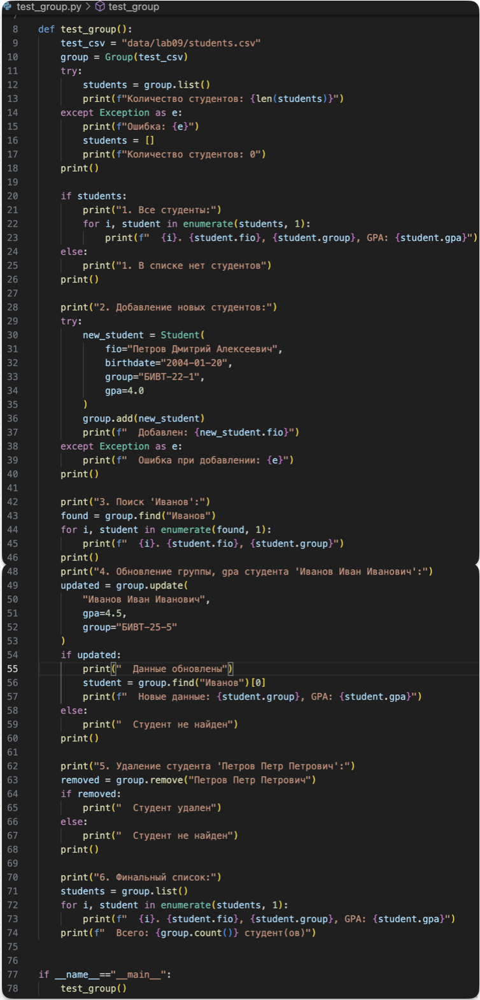
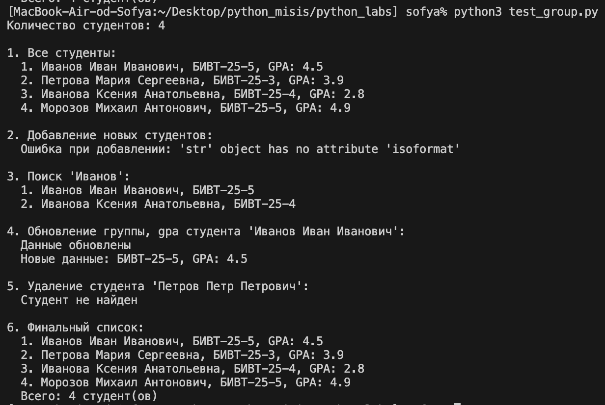

# LAB 01
[ссылка](src/lab01/README1.md)
# LAB 02
[ссылка](src/lab02/README_2.md)
# LAB 03
[ссылка](src/lab03/README_3.md)
# LAB 04
[ссылка](src/lab04/README_4.md)
# LAB 05
[ссылка](src/lab05/README_5.md)
# LAB 06
[ссылка](src/lab06/README_6.md)
# LAB 07
[text](src/lab07/README_7.md)
# LAB 08
[text](src/lab08/README_8.md)

# LAB 09
## программа

## тесты

## входные данные, файл csv

### выполнение тестов

