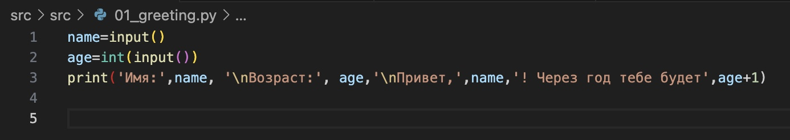
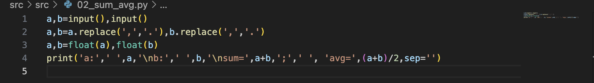

# LAB01
## 01_greeting [01](src/lab01/01_greeting.py)

## 02_sum_avg [02](src/lab01/02_sum_avg.py)

## 03_discount_vat [03](src/lab01/03_discount_vat.py)

## 04_minutes_to_hhmm [04](src/lab01/04_minutes_to_hhmm.py)

## 05_initials_and_len [05](src/lab01/05_initials_and_len.py)

## 06 [06](src/lab01/06.py)

## 07_word [07](src/lab01/07_word.py)

